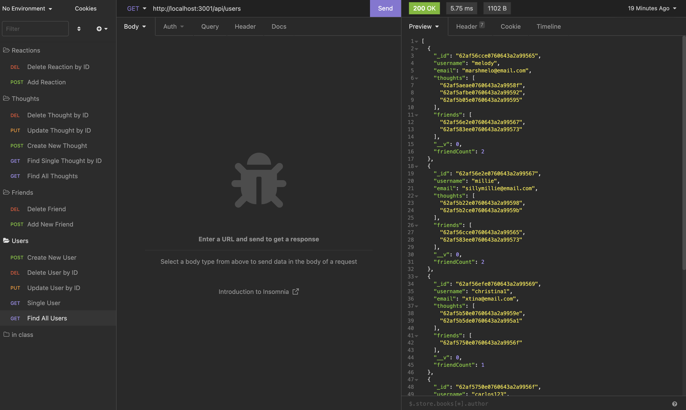
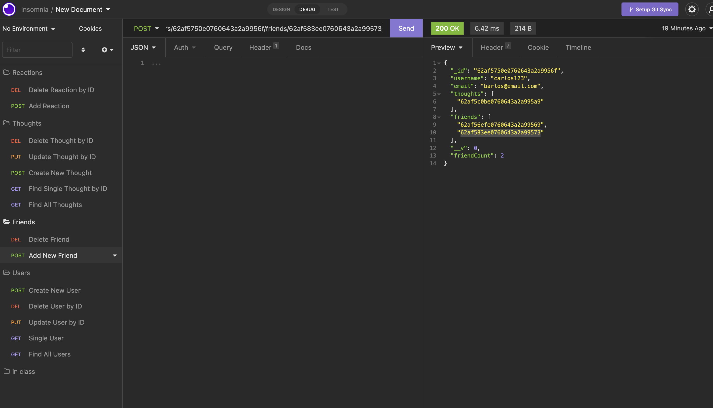
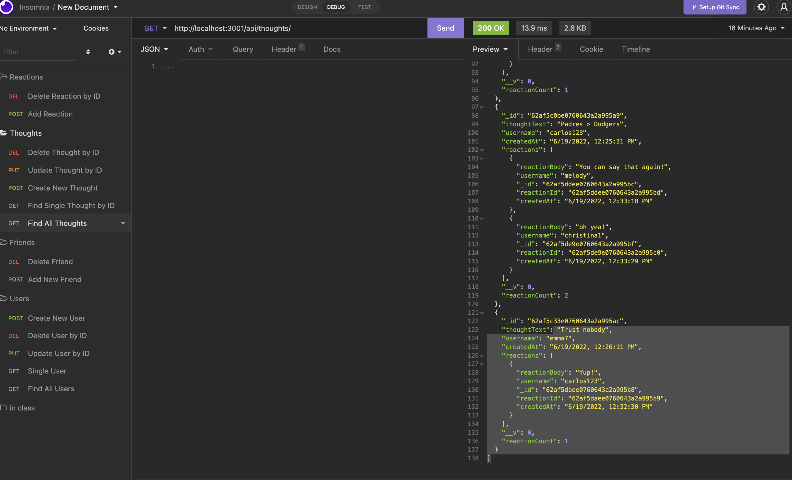
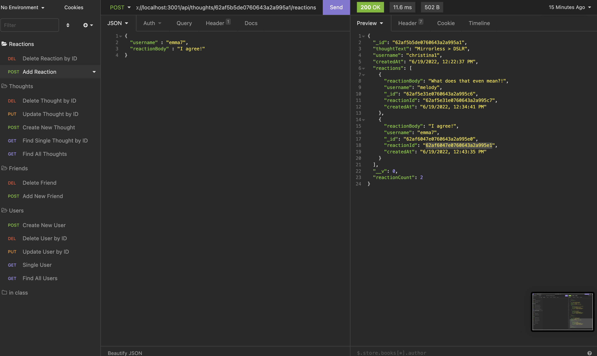

# social-network-APi

An API for a social network web application where users can share their thoughts, react to friends’ thoughts, and create a friend list. Uses Express.js for routing, a MongoDB database, and the Mongoose ODM. In addition to using the Express.js and Mongoose packages, it is also using a JavaScript date library to format timestamps. Seed data was creating using Insomnia.

## Table of Contents

- [Description](#description)
- [Installation](#installation)
- [Usage](#usage)
- [Technologies](#technologies)
- [Assets](#assets)

## Installation

to set up the environment for running this application:

- Clone this repo
- Install **MongoDB** on your local machine if you do not have one yet.
- Open the terminal and change directory to the folder you cloned your repo into
- Enter the following commands in terminal:
  - `npm init -y` - to generate the package.json and package-lock.json
    - If both files already exist, then skip this step
  - Open the _package.json_ file and check the "dependencies", type in `npm i` if you don't see the following:
    - "express"
    - "mongoose"
  - If missing , enter the following commands to install the associated packages:
    - `npm i express`
    - `npm i mongoose`
- Make sure your Repo has the _.gitignore_ file which includes `node_modules`, `.env` and `.DS_Store` (for macOS) before installing any npm dependencies
- Install [Insomnia](https://insomnia.rest/download) if you do not have it to test routes
- Install [MongoDBCompass](https://www.mongodb.com/docs/compass/current/install/) - we can use this to view data in database

## Usage

- Open the terminal and change directory to this Repo folder
  - To start the app: `npm start`
- Open Insomnia to test all routes:
  - GET routes to find all users and all thoughts
  - GET routes to find a single user and a single thought
  - POST routes to create new user and new thought
  - PUT routes to update user and thought
  - DELETE routes to delete user and thought
  - POST routes to add new friend to user and reaction to thought
  - DELETE routes to remove friend from user and reaction from thought
- Open MongoDBCompass to view data for users and thoughts

## Technologies

```
JavaScript
Express.js
Insomnia
MongoDB
Mongoose
```

## Assets

The following images demonstrate the Social Network API application's functionality:

View users:


Add friend:


View thoughts:


Add a reaction:

